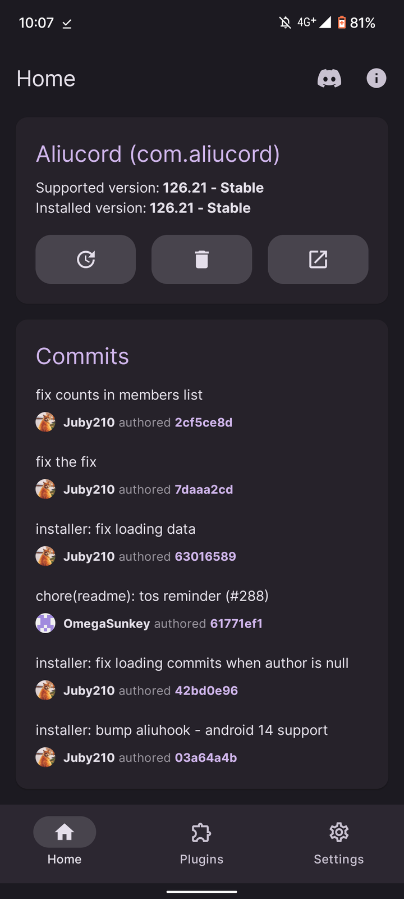
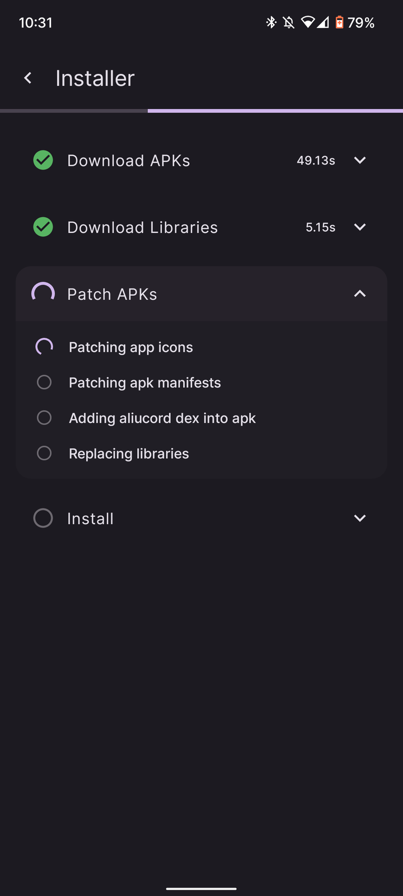

<script>
  import Repo from '$lib/components/extra/github_repo.svelte';
</script>

> Where can I download BetterDiscord for Android?

<Repo user="Aliucord" repo="Aliucord" />

Back in early 2021, not many Discord mods existed for phone users.
Even though there were a ton of mods for desktop like BetterDiscord or PowerCord, only a couple existed for phone users.
The only ones I still remember atm were:

- [CutTheCord] (*feature limited*)
- [Treecord] (*dead*-ish)
- Bluecord (*closed source, author has made a botnet*)

All 3 of these worked by the same principle, that being smali patches, making development extremely slow and limited in
complexity. The way smali patches work is, using something like [ApkTool], firstly you disassemble the app into an IR
called smali. Think assembly but instead for Java on Android. Next you modify the smali to add your functionality,
run a diff utility to document the changes you did, and reassemble into a functional apk.

For reference, here's an example that adds a simple log statement to the following snippet:

```diff
  int square(int var1) {
+ 	System.out.println("squaring: " + var1);
  	return var1 * var1;
  }
```

Equivalent smali changes:

```diff
+ getstatic java/lang/System.out:java.io.PrintStream
+ new java/lang/StringBuilder
+ dup
+ invokespecial java/lang/StringBuilder.<init>()V
+ ldc "squaring: "
+ invokevirtual java/lang/StringBuilder.append(Ljava/lang/String;)Ljava/lang/StringBuilder;
+ iload1
+ invokevirtual java/lang/StringBuilder.append(I)Ljava/lang/StringBuilder;
+ invokevirtual java/lang/StringBuilder.toString()Ljava/lang/String;
+ invokevirtual java/io/PrintStream.println(Ljava/lang/String;)V
  iload1
  iload1
  imul
  ireturn
```

The main issue with this method is that it's extremely time-consuming and just plainly way too hard.
Now, is there a way to modify methods with code we compile from *source*?

# Hooking

The main idea behind "hooking" is to be able to dynamically hook methods (run code before/after) at runtime without
requiring you to modify the actual source code.
[Frida] exists to do this, but it's too complex for what we need and more focused on debugging.
Xposed exists, but this is before the [LSPatch] era, and as such it needs root which only a minority of people have.

Let's take a look at [LSPosed], a Xposed implementation anyway.
Firstly, it relies on a [Magisk] (root framework) module to inject itself into the zygote, which is the root process
for all running applications. Skipping a few details, it loads [LSPlant], a hooking library into the process and loads
any registered Xposed modules. Such modules can then use LSPlant through the Xposed API to hook methods in the target
application just by name.

Here's one such module that changes how the clock is displayed in the built-in *SystemUI* Android app, which handles
your Android "desktop environment".

```java
public class RedClock implements IXposedHookLoadPackage {
	public void handleLoadPackage(LoadPackageParam lpparam) throws Throwable {
		if (!lpparam.packageName.equals("com.android.systemui")) return;
		
		findAndHookMethod(
			"com.android.systemui.statusbar.policy.Clock", // Qualified class name
			lpparam.classLoader, // Application classloader
			"updateClock", // Hook all with this method name
			new XC_MethodHook() {
				// Run after method
				@Override
				protected void afterHookedMethod(MethodHookParam param) throws Throwable {
					TextView tv = (TextView) param.thisObject; // Get "this"
					tv.setText(tv.getText().toString() + " :)"); // Adds a smiley to the clock
					tv.setTextColor(Color.RED); // Makes the clock red
				}
			}
		);
	}
}
```

To be clear, LSPlant itself does not require root, as every instance of Dalvik
(the Java VM on Android, later replaced by ART) is independent and can freely modify itself/the process.
As such, libraries such as [LSPlant], [Pine], [SandHook], [epic], and [YAHFA] all modify the underlying ART data
that represent runtime methods in order to hook them.
More on how this works in this Chinese [article] by *canyie* with a [translation].
It's like black magic really, I still don't fully understand it.

So why not use LSPlant directly? Well there are a few obstacles. For one, a more complicated build process
is needed in order to fit all the necessary components together. Next, we need something to compile code down
to dex bytecode (Java IR for ART). And lastly, we need to modify the APK enough in order to load LSPlant itself and
the rest of our external code, to avoid repackaging the entire thing on any minuscule change.

We eventually solved this with the development of the following projects:

- [Aliucord Manager](#aliucord-manager)
    - [Github](https://github.com/Aliucord/AliucordManager)
    - This is a separate app that repackages a Discord APK on the users phone in order to add LSPlant and the injector.
    - Also serves as a way to avoid DMCA for distributing APKs.
- [Aliucord Injector](#aliucord-injector)
    - [Github](https://github.com/Aliucord/Aliucord/tree/main/Injector)
    - Initializes LSPlant / other low level things
    - This is added into the APK to override a Discord method that is close to startup, in order to load Core.
- [Aliucord Core](#aliucord-core)
    - [Github](https://github.com/Aliucord/Aliucord/tree/main/Aliucord)
    - This is the "actual" place where modding starts.
    - It loads external plugins, initializes other utility patches, and adds bugfixes
- [Aliucord Gradle](#aliucord-gradle)
    - [Github](https://github.com/Aliucord/gradle)
    - This is a gradle plugin that is used solely for the build process in development.
    - Builds plugins, core, injector into the necessary format
        - Plugins & Core into a zip containing a manifest & code compiled to dex
        - Injector into an AAR containing dex to be used in manager

# Aliucord Manager

*Note:* Manager is not officially released but the earlier predecessor works in the same way.

[//]: # (FIXME: overscroll doesn't work)
<div class="flex gap-6 -my-6">
    
        
</div>

The first time a user touches your project they must have a good experience otherwise they'll just give up.
Manager was designed with this in mind, making the installation process as simple as possible if everything goes right.
Unfortunately because of Android™ and other differences between ROMs there's a ton of issues especially with how
obscure what we're trying to do is. MIUI is the biggest offender with its "MIUI Optimizations" that breaks everything
from installing an APK to hooking to literally anything on earth, and is a huge pain in the ass.

Assuming everything goes right however, after the user grants the necessary prompted permissions,
the repacking process is hidden under a single button and then installation happens seamlessly.

1. Download a base Discord v126.21 (126021) APK through our proxy, redirecting to an APK mirror site.
2. Download precompiled LSPlant, Core, Injector, and Kotlin builds through Aliucord's maven.
3. Since APKs are just a zip, open the APK using a zip library and:
    - Add in the LSPlant native library
    - Add in .dex containing Kotlin
    - Add in .dex containing Injector [<sup>[dex priority]</sup>](#dex-priority)
    - [Modify](https://github.com/Aliucord/AliucordManager/blob/main/app/src/main/kotlin/com/aliucord/manager/installer/util/ManifestPatcher.kt)
      the `AndroidManifest.xml` in order to:
        - Change app & package name
        - Add additional permissions
        - Change min sdk version, etc...
4. Resign the APK using a key generated on device
5. Install the APK

# Aliucord Injector

## .dex priority

Dex bytecode inside an APK in contained within .dex files, named `classes.dex` to `classes2.dex` to `classesN.dex`.
You can add any number of dex files, and they will __always__ be loaded in order.
As such, if two dex files contain classes with an identical name, the first one will *always* be processed instead,
and the 2nd one will be discarded.

This quirk is what Injector uses, we found an empty class (`App$a`) that was referenced from the entry point of the
application, running the static initializer block almost instantly. Great!
To clarify, we don't *need* an empty class, but the likelihood of it changing between updates is minimal since it looks
like it was generated by Kotlin, and as such likely won't break. (never did!)
Otherwise, you can replace any class really and just make sure to preserve the original code.

```java
package com.discord.app;
import android.app.Application;
import kotlin.jvm.internal.DefaultConstructorMarker;
	
public class App extends Application {
	public static final App.a Companion = new App.a(null);
	public static final class a {
		public a(DefaultConstructorMarker default) {}
	}
	// ...
}
```

We can now just make an identical class and set the injector as the first `classes.dex`, making it override the
identical class from subsequent dex files. From there, just we can call our injection logic directly.

```java
// This is a class by Discord which conveniently happens to be empty
// Thus it offers an amazing entry point for an injection since we can safely override the class
public final class App$a {
	static {
		InjectorKt.init();
	}

	public App$a(DefaultConstructorMarker defaultConstructorMarker) {}
}
```

# Aliucord Core

# Aliucord Gradle

[//]: # (@formatter:off)
[Aliucord]: https://github/Aliucord/Aliucord

[CutTheCord]: https://gitdab.com/distok/cutthecord
[Treecord]: https://github.com/Treecord/Treecord

[Frida]: https://github.com/frida
[LSPatch]: https://github.com/LSPosed/LSPatch
[LSPosed]: https://github.com/LSPosed/LSPosed

[LSPLant]: https://github.com/LSPosed/LSPlant
[Pine]: https://github.com/canyie/pine
[SandHook]: https://github.com/asLody/SandHook
[epic]: https://github.com/tiann/epic
[YAHFA]: https://github.com/PAGalaxyLab/YAHFA

[article]: https://blog.canyie.top/2020/04/27/dynamic-hooking-framework-on-art/
[translation]: https://blog-canyie-top.translate.goog/2020/04/27/dynamic-hooking-framework-on-art/?_x_tr_sl=auto&_x_tr_tl=en&_x_tr_hl=en

[Magisk]: https://github.com/topjohnwu/Magisk
[ApkTool]: https://github.com/iBotPeaches/Apktool
